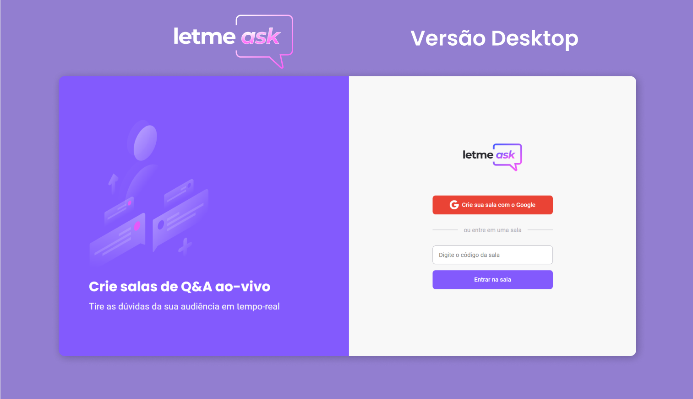

<div align="center">
  
</div>

##

<p align="center" style="margin-top: 10px">
<a href="#about">About</a>&nbsp;&nbsp;&nbsp;|&nbsp;&nbsp;&nbsp;
<a href="#getting_started">Getting started</a>&nbsp;&nbsp;&nbsp;|&nbsp;&nbsp;&nbsp;
<a href="#technologies">Technologies</a>&nbsp;&nbsp;&nbsp;|&nbsp;&nbsp;&nbsp;
<a href="#contribute">Contribute</a>&nbsp;&nbsp;&nbsp;|&nbsp;&nbsp;&nbsp;
</p>

## 🧐 About <a name = "about"></a>

letmeask is an application developed during **Next Level Week #6** offered by [Rocketseat]:rocket:. <br />

It consists of a platform to create Q&A rooms (questions and answers).

## 🚀 Getting started <a name = "getting_started"></a>

Clone the project and access the folder.

```
git clone https://github.com/GabrielCastilhoV/letmeask.git


# 💻 Starting the project

Access the folder:
$ cd letmeask

Install the dependencies:
$ yarn

Start the server:
$ yarn start
```

## ⛏️ Technologies <a name = "technologies"></a>

This project was developed using the following technologies:

- [React](https://reactjs.org)
- [Firebase](https://firebase.google.com/)
- [TypeScript](https://www.typescriptlang.org/)

## 🤔 Contribute <a name = "contribute"></a>

- Clone this repository: `git clone https://github.com/GabrielCastilhoV/letmeask.git`
- Create a branch with your feature: `git checkout -b my-feature`;
- Commit your changes: `git commit -m 'feat | my new feature'`;
- Push to your branch: `git push origin my-feature`.

By Gabriel Castilho 👋🏽 [Contact](https://www.linkedin.com/in/gabrielcastilhov/)
